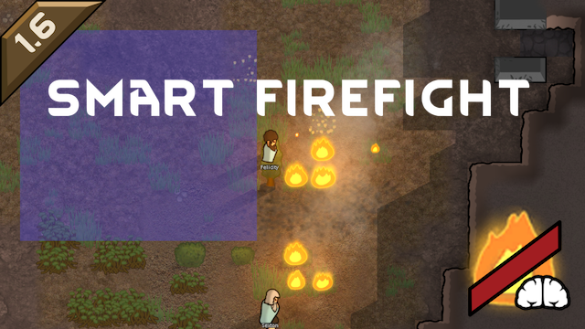

# Smart Firefight

This RimWorld mod brings in the following firefighting imrovements:
- Extinguish fire around home area automatically when needed.
- Extinguish fires order for mass extinguishing without need to extend home area.

## Supported RimWorld versions
- 1.6

## Supported languages
- English
- Russian

---

Built with [Unity Mod Studio](https://marketplace.visualstudio.com/items?itemName=darkdaskin.UnityModStudio2022).